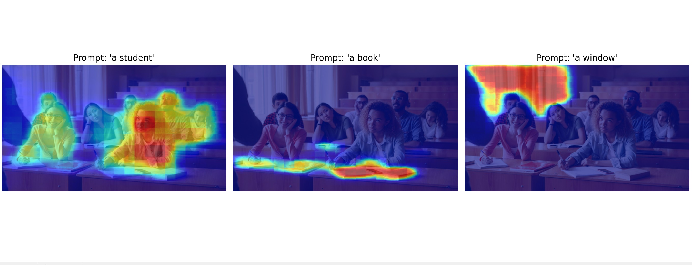
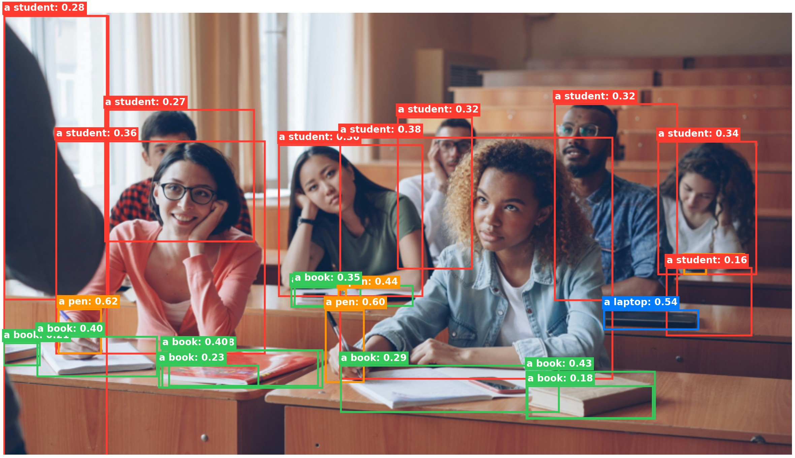

# 26-1 Deep Learning — Foundation Model Experiments

This repository explores multiple **state-of-the-art vision foundation models from Hugging Face** across different computer vision tasks. Each project was developed independently to analyze its specific architecture and later integrated into this unified interactive repository.

---

## Overview

The primary goal of this project is to **experiment with the real-world behavior and capabilities of foundation models**, moving beyond theoretical study. 

We cover three core paradigms of modern computer vision:
- **Vision-Language Question Answering (VQA)**
- **Open-Vocabulary Image Segmentation**
- **Open-Vocabulary Object Detection**

---

## Project Structure
```bash
26-1_DEEP_LEARNING_PJ/
├── data/
│   └── test_img.jpg             # Standard testing image
├── models/
│   ├── qwen_vlm.py              # Multimodal VQA script
│   ├── clip_segment.py          # Text-based segmentation script
│   └── owl_detection.py         # Text-based detection script
├── main.py                      # Unified interactive CLI runner
├── requirements.txt             # Dependency list
└── README.md                    # Project documentation
```
---

## Models Used

| Task | Model | Description | Parameters |
| :--- | :--- | :--- | :--- |
| **VQA / Chat** | `Qwen2.5-VL-Instruct` | Vision-language reasoning and context understanding | ~3B |
| **Segmentation** | `CLIPSeg` | Open-vocabulary segmentation using text prompts | ~44M |
| **Detection** | `OWL-v2` | Open-vocabulary zero-shot detection via text queries | ~153M |

---

## Tasks

### 1. Vision-Language Model (VQA)
* **Module:** `models/qwen_vlm.py`
* **Description:** Multimodal reasoning using Qwen2.5-VL. It understands spatial relationships and provides contextual answers.
* **Input:** `test_img.jpg` + Natural Language Question (User Prompt)
* **Output:** Generated Text Response
* **Example:** * *Input:* "How many laptops are on the desk?"
    * *Output:* "There are two laptops visible on the desk."

### 2. Open-Vocabulary Segmentation
* **Module:** `models/clip_segment.py`
* **Description:** Pixel-level segmentation for arbitrary text queries using CLIPSeg.
* **Input:** `test_img.jpg` + Target Labels (e.g., "student", "book")
* **Output:** Overlayed Heatmap Visualization (using Matplotlib)
* **Example Results:** A grid of images where the requested objects are highlighted in red (high probability).


### 3. Open-Vocabulary Detection
* **Module:** `models/owl_detection.py`
* **Description:** Language-driven object localization using OWL-v2.
* **Input:** `test_img.jpg` + Object Names (List of strings)
* **Output:** Bounding Boxes with Confidence Scores
* **Example Results:** The image marked with colored boxes and labels like `student: 0.95`.


---

## Setup & Execution

**1. Clone the repository**
```bash
git clone https://github.com/kim-taeho1351/26-1_DL_class_pj.git
```

**2. Install dependencies**
```bash
cd 26-1_DL_class_pj
```
```bash
pip install -r requirements.txt
```

**3. Data Preparation**
All model scripts in this project are designed to reference a specific image within the `data/` directory. 
You **must** complete the following steps before execution:
- If it doesn't already exist, create a `data` folder in the root directory of the project.
- Place the image file you wish to test inside the `data` folder.
- You **must** rename the image file to `test_img.jpg` (Target path: `data/test_img.jpg`).

**4. Run the Unified Pipeline**
### Launch the interactive CLI menu to select and execute any of the models.
```bash
python main.py
```